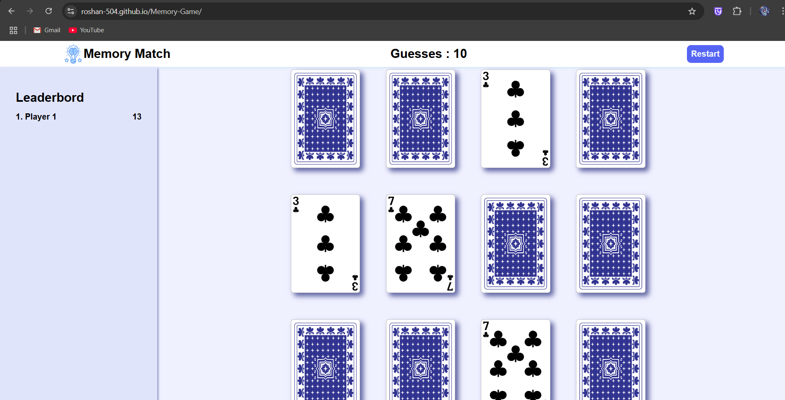

# 🃏 Memory Match Game

A fun and interactive card memory game built using HTML, CSS, and JavaScript. Flip cards to find matching pairs with the fewest number of guesses. Includes a leaderboard to track high scores!

## 🎮 Features

- Interactive card flipping
- Matching logic for pairs
- Guess counter to track attempts
- Leaderboard that ranks players by performance
- Restart button to reset the game anytime

## 📸 Live Demo

[Memory Game Live Demo Link](https://roshan-504.github.io/Memory-Game/)

## 🚀 Technologies Used

- **HTML5**
- **CSS3**
- **Vanilla JavaScript**

## 🧠 Game Logic

- 6 unique card pairs are shuffled and laid out randomly.
- Click to flip a card. Match 2 cards with the same value to keep them face-up.
- Game ends when all pairs are matched.
- Score is based on the number of guesses.
- Leaderboard updates after each round.

## 🛠️ How to Run

1. **Clone the Repository:**
   ```bash
   git clone https://github.com/Roshan-504/Memory-Game.git
   cd Memory-Game
   ```

2. **Open `index.html` in your browser:**
   No build tools or servers required – this is a pure frontend app!

## 📷 Screenshot

